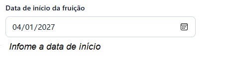
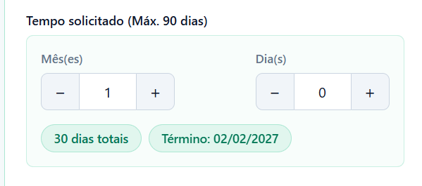
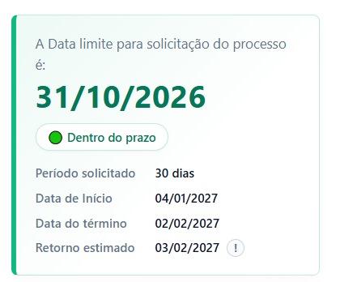

# Documentação Técnica: Simulador de Cálculo de Licença-Prêmio

  
  
  
  

## 1. Visão Geral do Sistema

O Simulador de Cálculo de Licença-Prêmio é uma extensão de navegador desenvolvida com foco na otimização direta de algumas rotinas operacionais específicas. A sua principal finalidade é agilizar, padronizar e conferir exatidão ao atendimento prestado aos servidores que buscam informações sobre a consulta do seu direito aquisitivo e os trâmites para a abertura de processos de Licença-Prêmio.

 O foco do sistema é eliminar a dependência de contagens manuais em calendários e a verificação morosa de normativas — processos suscetíveis a falhas humanas e que geram atrasos no atendimento. 

Desta forma, o RH é dotado de um mecanismo capaz de fornecer ao servidor respostas imediatas e relatórios estruturados contendo as datas exatas de fruição, estimativas seguras de retorno ao trabalho e a identificação rigorosa dos prazos limites para a formalização do requerimento.

## 2. Detalhamento das Funcionalidades

O sistema encontra-se dividido em módulos de operação que simulam todo cálculo de uma fruição para a LP:

### 2.1. Simulação de Fruição
O núcleo da extensão é responsável pela cronologia do afastamento. A partir da inserção da data pretendida para o início da fruição, o sistema solicita a definição do período (limitado aos parâmetros legais de 1 a 3 meses, ou até 90 dias). Com estes dados, o algoritmo processa:
*   **Data de Término:** Cálculo exato do último dia de afastamento.
*   **Estimativa de Regresso:** Projeção automática da data em que o servidor deverá apresentar-se ao serviço, porém como essa data pode variar, a informação servirá apenas como uma base. É importante que confirme com a unidade após o processo ja ter sido realizado.

### 2.2. Sistema de Gestão de Prazos
Para mitigar o risco de indeferimentos ou Retorno de processo sem análise por incumprimento de prazos, a ferramenta incorpora um sistema preventivo de alertas.
*   **Identificação de Data-Limite:** O algoritmo retrocede no calendário para estipular o último dia útil disponível para a abertura formal do processo administrativo.
*   **Sinalização de Criticidade:** Através de uma interface baseada em estados (Verde para prazos seguros, Amarelo para proximidade de vencimento e Vermelho para prazos expirados), o utilizador é informado visualmente sobre a urgência do trâmite.

### 2.3. Módulo Analítico de Quinquênio
Esta funcionalidade opcional funciona como uma auditoria do período aquisitivo do servidor.
*   **Cálculo Inverso:** O utilizador insere a data final do quinquênio a ser analisado. A partir deste marco, o sistema reconstrói o período aquisitivo de 5 anos.
*   **Validação de Vigência:** O sistema verifica se o direito à licença ainda se encontra válido ou se já prescreveu, aplicando regras temporais complexas e enquadramentos legais específicos (como pareceres da Procuradoria-Geral).

### 2.4. Integração e Exportação de Relatórios
Toda a informação processada pode ser rapidamente extraída para alimentar outros sistemas corporativos ou processos físicos:
*   **Exportação em Texto e PDF:** Compilação dos dados prontos a ser copiado para a área de transferência ou baixar em PDF, com um clique.

### 2.5. Arquitetura de Interface Responsiva
O design foi concebido para não interromper o fluxo de trabalho do utilizador:
*   **SidePanel:** Operação nativa numa barra lateral discreta, permitindo que o utilizador consulte sistemas internos da instituição simultaneamente no ecrã principal. Pode-se arrastar essa barra e ajustar o taamnho, se preferir.
*   **Modo de Ecrã Completo:** Capacidade de expansão da interface para uma aba dedicada, proporcionando maior conforto visual em análises complexas ou durante a impressão de relatórios.

## 3. Segurança e Privacidade (Compliance)

A extensão foi desenvolvida em estrita conformidade com as diretrizes do **Manifest V3**. 
*   **Processamento Local (Client-Side):** Todo o cálculo e manipulação de dados ocorre exclusivamente no navegador do utilizador.
*   **Privacidade de Dados:** A ferramenta não estabelece ligações externas (sem chamadas a APIs de terceiros), não recolhe métricas de utilização e não armazena dados sensíveis do servidor, assegurando total aderência às normas de proteção de dados.

## 4. Instalação

BREVE OS LINKS DA EXTENSÃO NAS LOJAS DE ADDONS DOS BROWSERS!

## 5. Como usar

### 5.1. Preenchimento de Dados e Parâmetros de Fruição
O procedimento inicia-se com a inserção dos dados bases da solicitação:
*   **Nome do(a) servidor(a):** Campo de identificação textual que será incorporado ao cabeçalho do relatório final que pode ser exportado.
 
    

*   **Data de início da fruição:** Insira a data exata a partir da qual o servidor pretende iniciar o seu afastamento.
 
    

*   **Tempo solicitado:** Insira o tempo que quer se afastar, o sistema permite selecionar no máximo 90 dias.
 
    

### 5.2. Validação de Quinquênio (Opcional)
Se preferir, poderá também verificar sobre a disponibilidade do seu quinquênio, basta habilitar a opção "Validar limite do quinquênio":
*   **Data Término do período aquisitivo:** Deve ser inserida a data final do ciclo de aquisição do direito.
 
    

*   Com base nesta data, será cálculado os 5 anos para enquadrar o período aquisitivo correto, e será feito a simulação de sua validade legal.

### 5.3. Interpretação do Painel de Resultados
Após a inserção dos parâmetros, o sistema compila instantaneamente um relatório consolidado. O painel destaca a **data-limite exata para abertura do processo** (sinalizada por um alerta visual de urgência) e reforça o aviso normativo da CGPP sobre a antecedência de 60 dias. Em paralelo, a interface exibe um **resumo cronológico completo** — detalhando o início, término e o retorno estimado com compensação de fins de semana — e, quando acionada, integra a **análise legal do quinquênio**, atestando de forma objetiva a validade ou prescrição do período aquisitivo.
 
    

### 5.4. Finalização e Integração de Dados
Para concluir o procedimento, a ferramenta disponibiliza três ações:
*   **Copiar resultado:** Transcreve todo o painel consolidado para a área de transferência.
*   **Baixar resultado:** Aciona o módulo de impressão do navegador para gerar um documento PDF estruturado.
*   **Refazer:** Botão de reset localizado na coluna de entrada que limpa todos os parâmetros atuais.