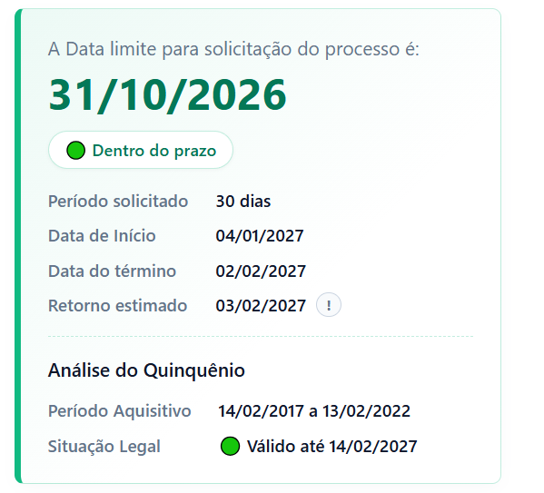

# Simulador de Cálculo de Licença-Prêmio

  
  
  
  

## 1. Visão Geral do Sistema

O Simulador de Cálculo de Licença-Prêmio é uma extensão de navegador desenvolvida com foco na otimização direta de algumas rotinas operacionais específicas. A sua principal finalidade é agilizar, padronizar e auxiliar no atendimento prestado aos servidores que buscam informações sobre a consulta do seu direito aquisitivo e os trâmites para a abertura de processos de Licença-Prêmio. Sendo utilizado principalmente pelos setores de recursos humanos.

A ferramenta automatiza o cálculo de prazos e a validação de normativas, substituindo processos manuais e passíveis de erro. Com isso, o RH ganha eficiência ao entregar aos servidores previsões precisas de fruição e os prazos regulamentares para o encaminhamento dos pedidos.

## 2. Detalhamento das Funcionalidades

O sistema encontra-se dividido em módulos de operação que simulam todo cálculo de uma fruição para a LP:

### 2.1. Simulação de Fruição
Nessa parte, o sistema funcionará calculando o período a partir da inserção da data pretendida para o início da fruição, o sistema solicita a definição do período (limitado aos parâmetros legais de 1 a 3 meses (limite máximo 90 dias). Com estes dados, o algoritmo processa:
*   **Data de Término:** Cálculo do último dia de afastamento.
*   **Estimativa de Regresso:** Projeção automática da data em que o servidor deverá apresentar-se ao serviço, porém como essa data pode variar, a informação servirá apenas como uma base. É importante que confirme com a unidade após o processo ja ter sido realizado.

### 2.2. Sistema de Gestão de Prazos
Para mitigar o risco de indeferimentos ou Retorno de processo sem análise por incumprimento de prazos, a ferramenta incorpora um sistema preventivo de alertas, representando a data limite para a abertura de um processo, com dados de fácil leitura.

### 2.3. Módulo Analítico de Quinquênio
Auditoria opcional do período aquisitivo do servidor:
* **Cálculo:** Reconstrói o ciclo de 5 anos a partir da data final informada.
* **Validação de Vigência:** Verifica a validade do quinquênio com base na data informada, servindo como informação caso o servidor tenha dúvidas sobre seu período aquisitivo.

### 2.4. Exportação de Relatórios
* **Ações Rápidas:** Cópia dos dados formatados para a área de transferência ou exportação em PDF com um clique.

### 2.5. Arquitetura de Interface Responsiva
O design foi concebido para não interromper o fluxo de trabalho do utilizador:
*   **SidePanel:** Operação nativa numa barra lateral, permitindo que o utilizador abra a extensão sem precisar sair da aba que se encontra. Pode-se arrastar essa barra e ajustar o seu tamanho, se preferir.

## 3. Segurança e Privacidade (Compliance)

A extensão foi desenvolvida em estrita conformidade com as diretrizes do **Manifest V3**. 
*   **Processamento Local (Client-Side):** Todo o cálculo e manipulação de dados ocorre exclusivamente no navegador do utilizador.
*   **Privacidade de Dados:** A ferramenta não estabelece ligações externas (sem chamadas a APIs de terceiros), não recolhe métricas de utilização e não armazena dados sensíveis do servidor, assegurando total aderência às normas de proteção de dados.

## 4. Instalação

BREVE OS LINKS DA EXTENSÃO NAS LOJAS DE ADDONS DOS PRINCIPAIS NAVEGADORES!

## 5. Como usar

### 5.1. Preenchimento de Dados e Parâmetros de Fruição
O procedimento inicia-se com a inserção dos dados bases da solicitação:
*   **Nome do(a) servidor(a):** Campo de identificação textual que será incorporado ao cabeçalho do relatório final que pode ser exportado.
 
    

*   **Data de início da fruição:** Insira a data exata a partir da qual o servidor pretende iniciar o seu afastamento.
 
    

*   **Tempo solicitado:** Indique o período de afastamento desejado, respeitando o limite máximo de três meses (90 dias). O sistema aceita também o preenchimento flexível por meses e dias fracionados.
 
    

### 5.2. Validação de Quinquênio (Opcional)
Para verificar a disponibilidade de um quinquênio, ative a opção "Validar limite do quinquênio". informe:
*   **Data Término do período aquisitivo:** Deve ser inserida a data final de aquisição do direito.
 
    

*   Com base nesta data, será cálculado os 5 anos para enquadrar o período aquisitivo correto, e será feito a simulação de sua validade legal.

### 5.3. Painel de Resultados
Após a inserção dos parâmetros, o sistema compila instantaneamente um relatório destacando a **data-limite exata para abertura do processo** (sinalizada por um alerta visual). Exibirá também um **resumo cronológico** — detalhando o início, término e o retorno estimado do servidor. Quando acionada, integra a **análise legal do quinquênio**, atestando de forma objetiva a validade ou prescrição do período aquisitivo.
<table>
  <tr>
    <td align="center" valign="top">
      
    </td>
    <td align="center" valign="top">
      
    </td>
  </tr>
</table>

### 5.4. Finalização e Integração de Dados
Para concluir o procedimento, a ferramenta disponibiliza três ações básicas:
*   **Copiar resultado:** Transcreve todo o painel consolidado para a área de transferência.
*   **Baixar resultado:** Aciona o módulo de impressão do navegador para gerar um documento PDF estruturado.
*   **Refazer:** Botão de reset localizado na coluna de entrada que limpa todos os parâmetros atuais.
